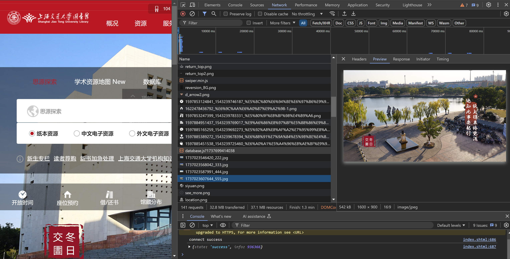
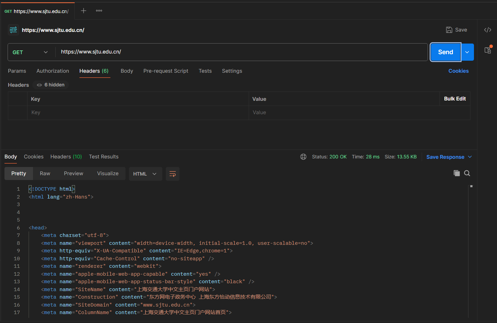
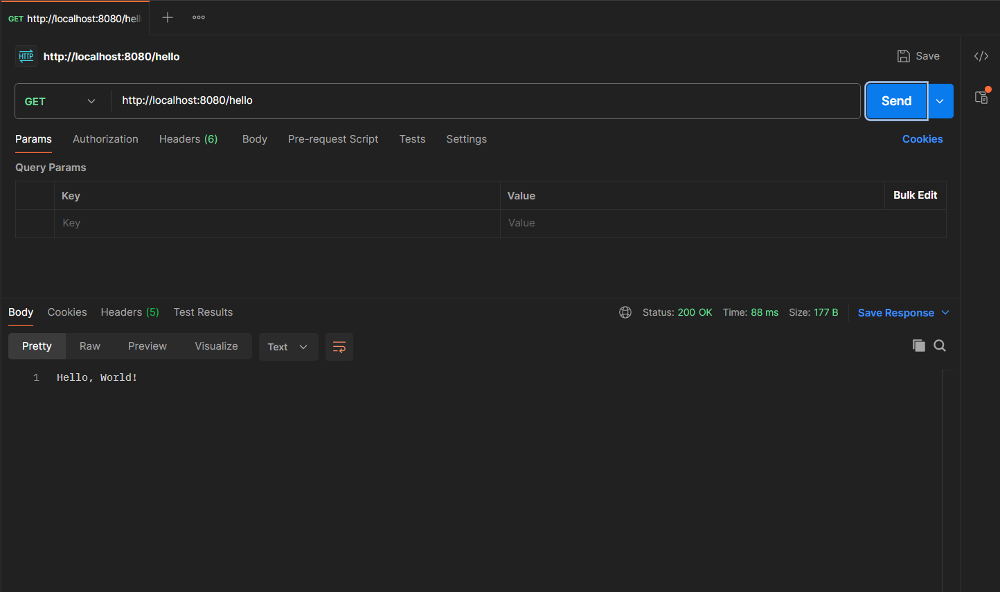
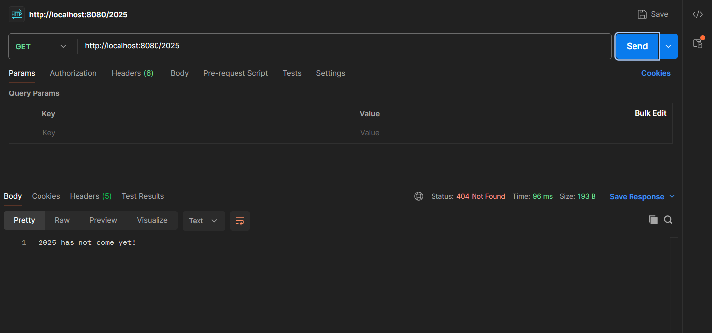

# 技术部实践任务第三期

# 任务一 HTTP
## 第一节 



刷新页面后，开发者工具显示了多种资源请求，包括图片、HTML、JavaScript和CSS文件。每个请求都有状态码，显示是否成功加载。大多数请求是GET类型，没有请求体。资源加载时间和大小也被显示。


## 第二节 构建请求



HTTP响应中的各部分含义：

- Status：200 OK表示请求成功。
- Time：响应时间为28毫秒。
- Size：响应体大小为13.55KB。
- Headers：包括缓存控制、浏览器兼容性设置等。
- Body：返回的HTML内容，包含网页的元数据

# 任务二 Java 初步
## 第一节 配置环境


## Java基础

```java
public class Main {
    public static void main(String[] args) {

        // 1 数据类型与运算符 （一）

        int a, c;
        boolean b;
        double d;
        a = 7;
        c = 25;
        d = a / c;
        b = (d * 25 <= 7);
        System.out.println(a);
        System.out.println(b);
        System.out.println(c);
        System.out.println(d);


        // 2 数据类型与运算符 （二）
        d -= 1;
        c = c + (~(a ^ 11));
        b = b & (a << 1 > c);
        System.out.println(b);
        System.out.println(c);
        System.out.println(d);


        // 3 控制结构

        for (int i=0; i<a-4; i++) {
            if (c % 2 != 0){
                c++;
            }
            else{
                c = c / 2;
            }
        }
        while (d >= -6){
            a = (int) (a + d);
            d *= 2;
        }
        System.out.println(a);
        System.out.println(c);
        System.out.println(d);


        // 4 字符串与数组

        String string = "Hello 2025";
        char[] array = new char[string.length()];
        string.getChars(0, string.length(), array, 0);
        for (int i = 0; i < array.length / 2; i++) {
            char temp = array[i];
            array[i] = array[array.length - 1 - i];
            array[array.length - 1 - i] = temp;
        }

        System.out.println(string.charAt(a));
        System.out.println(array[c]);

        // Substring
        System.out.println(string.substring(a, 3) + string.substring(c));


        // 5. 阶乘，排列数， 组合数
        System.out.println(factorial(c));
        System.out.printf("permutations of (%d, %d) : " +  permutations(a+c, 10) + "\n", a+c, 10);
        System.out.printf("combinations of (%d, %d) : " +  combinations(a+c, 10) + "\n", a+c, 10);

        // 6. 异常捕获
//      factorial(-1);

        // 7. 泛型容器与包装类型
        java.util.ArrayList<Character> arrayList = new java.util.ArrayList<Character>();
        for (int i = 0; i < array.length; i++) {
            if (i % 2 == 1) {
                arrayList.add(array[i]);
            }
        }
        while (!arrayList.isEmpty()) {
            char last = arrayList.getLast();
            System.out.print(last + ' ');
            arrayList.removeLast();
        }
        System.out.println(arrayList);

    }

    public static long factorial(long n) {
        if (n < 0){
            throw new IllegalArgumentException("n must be a positive number");
        }
        long result = 1;
        for (long i = 1; i <= n; i++){
            result *= i;
        }
        return result;
    }
    public static long permutations(long m, long n) {
        if (m > n){
            throw new IllegalArgumentException("m must be smaller or equal to n");
        }
        return factorial(n) / factorial(n - m);
    }
    public static long combinations(long m, long n) {
        if (m > n){
            throw new IllegalArgumentException("m must be smaller or equal to n");
        }
        return factorial(n) / ( factorial(n - m) * factorial(m)) ;
    }

}

```

引用类型是指存储对象的内存地址，而不是直接存储数据的类型。字符串相等的判断方式 ： 
- == 运算符 ： 比较的是对象的地址。
- equals() 方法 ： 比较字符串的内容。

```java
String str1 = new String("hello world");
String str2 = new String("hello world");
System.out.println(str1 == str2); //  false, 内存地址不同
System.out.println(str1.equals(str2)); // true, 内容相同
```

## 第四节 面向对象

```java
class Animal<T> {
    public T name;

    public Animal(T name) {
        this.name = name;
    }

    public void say() {
        System.out.println(name + " is saying");
    }
}

class Dog extends Animal<String> implements Behavior {
    public Dog(String name) {
        super(name);
    }

    @Override
    public void say() {
        System.out.println(name); // 只输出名字
    }

    @Override
    public void run() {
        System.out.println(name + " is running");
    }

    @Override
    public void sleep() {
        System.out.println(name + " is sleeping");
    }
}

class Cat extends Animal<String> implements Behavior {
    public Cat(String name) {
        super(name);
    }

    @Override
    public void say() {
        System.out.println(name); // 只输出名字
    }

    @Override
    public void run() {
        System.out.println(name + " is running");
    }

    @Override
    public void sleep() {
        System.out.println(name + " is sleeping");
    }
}

public class Main {
    public static void main(String[] args) {
        Dog dog = new Dog("Buddy");
        Cat cat = new Cat("Whiskers");

        // 调用每个对象的方法
        dog.say();
        dog.run();
        dog.sleep();

        cat.say();
        cat.run();
        cat.sleep();

        // 调用静态方法
        say(dog);
        runAndSleep(dog);
        say(cat);
        runAndSleep(cat);
    }

   
    public static void say(Animal<?> animal) {
        animal.say();
    }

   
    public static void runAndSleep(Behavior behavior) {
        behavior.run();
        behavior.sleep();
    }
}
```

Java的类型系统是静态的，类型检查在编译时进行，这可以减少运行时错误。泛型提高了代码的通用性和类型安全性。 
不过泛型通过类型擦除机制工作，导致在运行时丧失具体类型信息。

# 任务三 Spring Boot 

## 第二节 用@Controller注解处理请求

创建 controller
```java
package com.example.demo.controller;

import org.springframework.http.HttpStatus;
import org.springframework.http.ResponseEntity;
import org.springframework.web.bind.annotation.RequestMapping;
import org.springframework.web.bind.annotation.RestController;

@RestController
public class TestController {

    // 处理 GET /hello 请求
    @RequestMapping(value= "/hello")
    public String hello() {
        return "Hello, World!"; 
    }

    // 处理 GET /2025 请求
    @RequestMapping(value ="/2025")
    public ResponseEntity<String> notFound() {
        return new ResponseEntity<>("2025 has not come yet!", HttpStatus.NOT_FOUND); // 返回404错误和消息
    }
}
```

- GET `/hello`


- GET `/2025`



